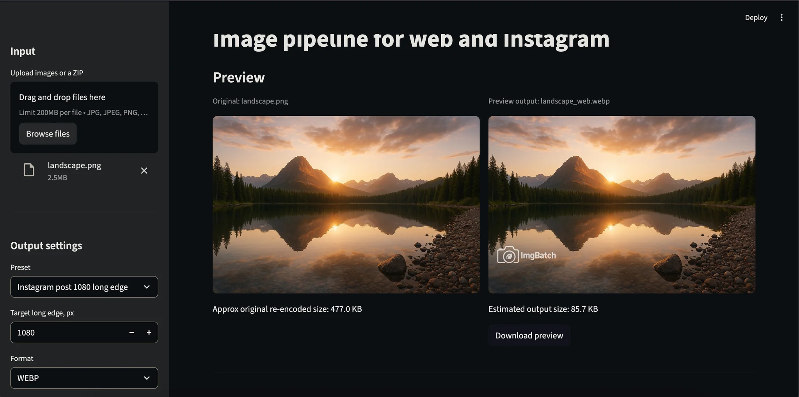

# photo-webify

[](https://photo-webify.streamlit.app)



A minimal Streamlit app for turning high-resolution photos into web-ready versions.  
It resizes, compresses, converts formats (JPEG/WebP), and optionally applies a watermark.  
Supports single or multiple files, or a ZIP archive in/out, with a live preview.

## Features

- Input: JPEG, PNG, WebP, TIFF, or a ZIP containing those
- Output: JPEG or WebP (single or ZIP batch)
- Resize by long edge with presets for web/Instagram/socials
- Adjustable quality, progressive JPEG, optimize flag
- Automatic sRGB conversion and optional metadata stripping
- Optional watermark:
  - Upload PNG watermark file
  - Choose corner or center placement
  - Control relative size, opacity, margin
  - Optionally invert watermark colors
- Live preview of processed sample with size estimate
- Batch process and export

## Quickstart

### Run locally (without Docker)

```bash
python3 -m venv venv
source venv/bin/activate
pip install -r requirements.txt
streamlit run app.py
```

Open [http://localhost:8501](http://localhost:8501) in your browser.

### Run with docker

```bash
docker build -t photo-webify .
docker run --rm -p 8501:8501 -v "$PWD":/app photo-webify
```

### Repository layout

```
.
├── app.py
├── requirements.txt
├── Dockerfile
└── .streamlit/
    └── config.toml
```

### License

This project is licensed under the MIT License. See LICENSE for details.